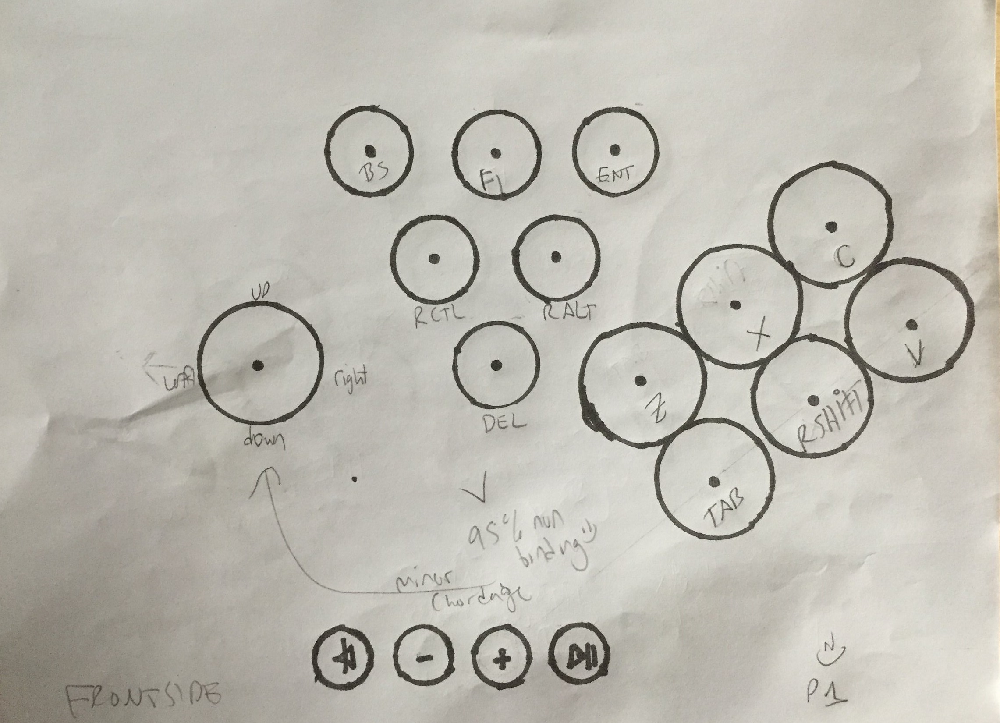
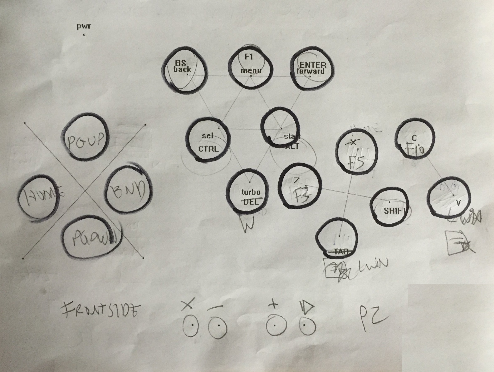

Welcome to Project HADOUKEN...
Streetfighter, Balloon Fight, Zelda, or any great retro rom deserve a proper arcade joypad. Wireless HID designed with Lakka in mind.

<u>If you just want a cheap controller this isn't it - (instead, get asin B008DPQ4QI / B01NCJ42H9 - great for lakka).
This is the way to HADOUKEN... </u>

The commited pdf  file can be used as a template to mark your holes on the lego case.  You can scale it when printed/copied/photocopied per the scalers in the image to achieve a relatively accurate reproduction.

Warning - these bins can brick your device.  Take extreme care to ensure you have no loss of connection or power during flash!
Because I've tailored these bins to impersonate a logitech keyboard device (and it's pairing modes) please note the following:
<li>I make no claim on the IP of logitech nor their Unifying technology
<li>I do not in any way license or permit the use of this code for ANY commercial applications - and have no right to
<li>due to lack of FCC certifications or any testing for possible interference, do NOT use on/near aircraft or other such device
 
(Note, there is some intentional overlap near top row of P1 and P2 controller)
<li>The keyboard version  best for P1
<li>The player-two rom is using mostly control keys  P2
<li>(if paired to one dongle each, these can of course be used apart as P1)

(btw, lakka aside, this is a portable HID. For ubuntu, solaar for linux is a sweet suite for logitech -- does more than oem app)

With minimal handling and no heat, the push-in quick-dev plates have been suprisingly reliable on the long term.

Tools:
<li>Christmas-tree/stepping bit(s)
<li>Drill
<li>Soldering Iron

Consumables:
<li>Mod wire kit with breadboard. amazon asin B01DROQSKQ 

BOM:
<li>bluetooh keyboard module for the bins - https://www.adafruit.com/product/1535
<li>Joystick, applicaton spefic non-analogue. amazon asin B01MY8NQEW
<li>buttons, med, 12mm. amazon asin B01N5JRU2R
<li>buttons, large, 30mm. amazon asin B01MRWL6DW
<li>Power switch, push-pull. amazon asin B000CPIQYU
<li>plastic grommets
<li>washers, misc.
<li>Lego case

Lego's pre-soy abs is amazing plastic.  If I were professionally sculpt a product I'd take it over ANYTHING.  It cuts like butter, has a rapid glass transition phase in/out, and is solid/strong like nothing else.
So for my donor, I grabbed their little case (and got it _full of legos/minifigures_ cheaper than a purposed case online with reviews about questionable material)

